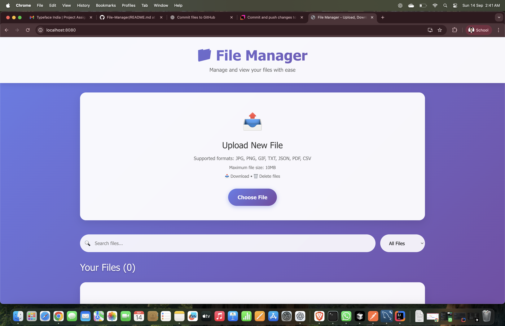
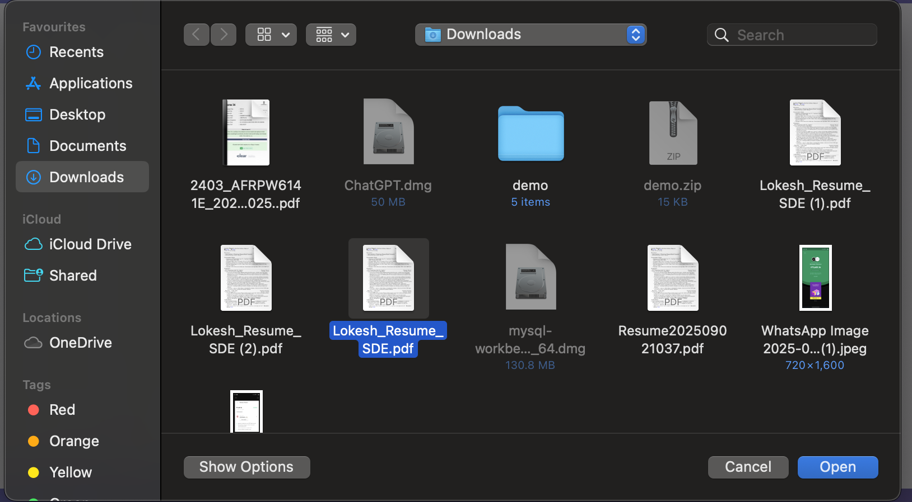
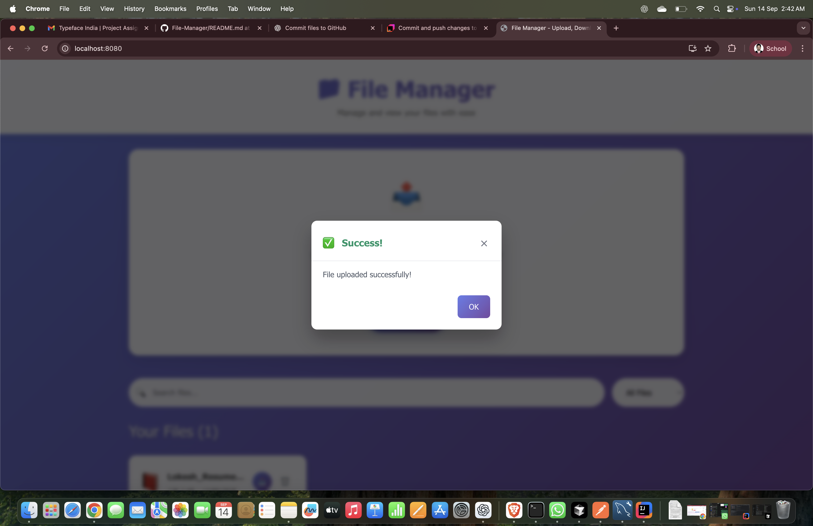
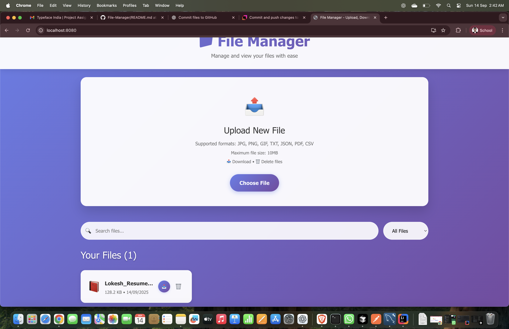
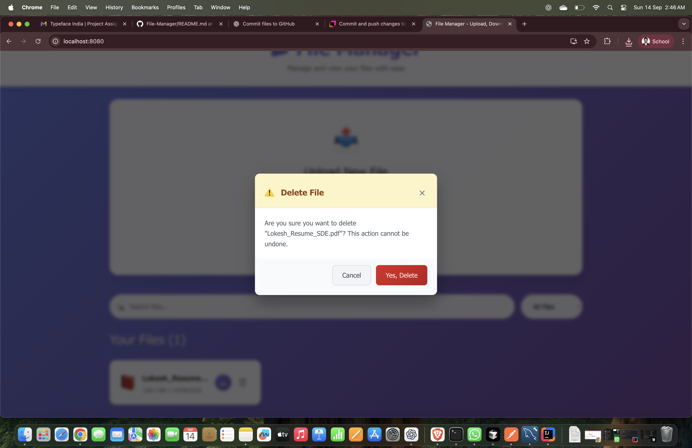
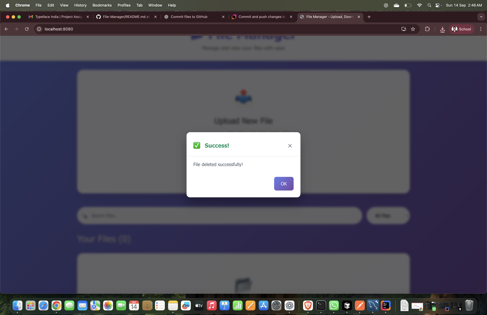

# 📁 File Manager

A modern, full-stack file management system built with **Spring Boot** and **React**. Upload, download, and manage your files with a beautiful, responsive user interface.

## ✨ Features

- **📤 File Upload** - Drag & drop or click to upload files
- **📥 File Download** - One-click download with progress indicators
- **🗑️ File Management** - Delete files with confirmation
- **🔍 Search & Filter** - Find files quickly with search and type filtering
- **📱 Responsive Design** - Works perfectly on desktop and mobile
- **🎨 Modern UI** - Beautiful gradient design with smooth animations
- **🔒 File Validation** - Built-in validation for file types and sizes

## 🚀 Tech Stack

### Backend
- **Java 17**
- **Spring Boot 3.4.9**
- **Spring Data JPA**
- **MySQL Database**
- **Maven**

### Frontend
- **React 18**
- **Bootstrap 5**
- **Axios**
- **Modern CSS with Animations**

## 📁 Supported File Types

| Type | Extensions | Icon |
|------|------------|------|
| **Images** | .jpg, .jpeg, .png, .gif | 🖼️ |
| **Documents** | .pdf | 📕 |
| **Text** | .txt | 📄 |
| **Data** | .json, .csv | 📋 |

## 📸 Screenshots

### Complete User Flow

#### 1. Main Interface

*Clean, modern interface with file upload and management capabilities*

#### 2. File Selection

*Easy file selection with drag & drop support*

#### 3. File Upload Progress

*Real-time upload progress with beautiful animations*

#### 4. Upload Success

*Custom success popup for successful file uploads*

#### 5. Delete Confirmation

*Confirmation popup for file deletion with clear action buttons*

#### 6. Delete Success

*Success confirmation after file deletion*

## 🛠️ Installation & Setup

### Prerequisites
- **Java 11 or higher** - [Download here](https://adoptium.net/)
- **Node.js 14 or higher** - [Download here](https://nodejs.org/)
- **MySQL Database** - [Download here](https://dev.mysql.com/downloads/)

### 🚀 Quick Setup (Recommended)

**For Unix/Linux/macOS:**
```bash
# Clone the repository
git clone <your-repo-url>
cd file-manager

# Run the setup script
./setup.sh

# Start the application
./run.sh
```

**For Windows:**
```cmd
REM Clone the repository
git clone <your-repo-url>
cd file-manager

REM Run the setup script
setup.bat

REM Start the application
run.bat
```

The setup script will automatically:
- ✅ Check prerequisites (Java & Node.js)
- ✅ Install frontend dependencies
- ✅ Build React frontend
- ✅ Copy frontend to Spring Boot static folder
- ✅ Build Spring Boot JAR
- ✅ Ready to run!

### 🔧 Manual Setup

If you prefer to set up manually:

1. **Clone the repository:**
   ```bash
   git clone <your-repo-url>
   cd file-manager
   ```

2. **Set up Frontend:**
   ```bash
   cd web-src
   npm install
   npm run build
   cd ..
   ```

3. **Copy Frontend Build:**
   ```bash
   # Unix/Linux/macOS
   rm -rf src/main/resources/static/*
   cp -r web-src/build/* src/main/resources/static/
   
   # Windows
   del /q src\main\resources\static\*
   xcopy web-src\build\* src\main\resources\static\ /E /I /Y
   ```

4. **Build Spring Boot:**
   ```bash
   ./mvnw clean package -DskipTests
   ```

5. **Run Application:**
   ```bash
   java -jar target/demo-*.jar
   ```

### 📊 Database Configuration (Required)

**Important:** The application requires a MySQL database for persistent file storage. The H2 in-memory database is only for development and will lose all data when the application restarts.

1. **Install MySQL:**
   - Download from [MySQL Official Site](https://dev.mysql.com/downloads/)
   - Or use package manager: `brew install mysql` (macOS) / `sudo apt install mysql-server` (Ubuntu)

2. **Create Database:**
   ```sql
   mysql -u root -p
   CREATE DATABASE demo;
   ```

3. **Update Database Credentials (if needed):**
   ```properties
   # src/main/resources/application.properties
   spring.datasource.username=your_mysql_username
   spring.datasource.password=your_mysql_password
   ```
   
   **Default configuration:**
   - Database: `demo`
   - Username: `root`
   - Password: `admin@123`
   - URL: `jdbc:mysql://localhost:3306/demo`

4. **Start MySQL Service:**
   ```bash
   # macOS
   brew services start mysql
   
   # Ubuntu/Debian
   sudo systemctl start mysql
   
   # Windows
   # Start MySQL service from Services.msc
   ```

## 🎯 Usage

1. **Upload Files:** Click "Choose File" to upload new files
2. **Download Files:** Click the 📥 download button on any file
3. **Delete Files:** Click the 🗑️ delete button to remove files
4. **Search Files:** Use the search bar to find specific files
5. **Filter Files:** Use the dropdown to filter by file type

## 📊 API Endpoints

| Method | Endpoint | Description |
|--------|----------|-------------|
| `POST` | `/api/files/upload` | Upload a new file |
| `GET` | `/api/files` | Get all files |
| `GET` | `/api/files/{id}` | Get file by ID |
| `GET` | `/api/files/{id}/download` | Download file |
| `DELETE` | `/api/files/{id}` | Delete file |
| `GET` | `/api/files/search?q={query}` | Search files |
| `GET` | `/api/files/filter?type={type}` | Filter files by type |

## 🗂️ Project Structure

```
file-manager/
├── src/main/java/com/example/demo/
│   ├── controller/          # REST API Controllers
│   ├── service/            # Business Logic
│   ├── repository/         # Data Access Layer
│   ├── model/              # Entity Models
│   ├── config/             # Configuration
│   └── exception/          # Exception Handling
├── src/main/resources/
│   ├── uploads/            # File Storage Directory
│   └── application.properties
├── frontend/               # React Application
│   ├── src/
│   │   ├── components/     # React Components
│   │   ├── services/       # API Services
│   │   └── styles/         # CSS Styles
│   └── public/
└── README.md
```

## 🔧 Configuration

### File Upload Limits
- **Maximum file size:** 10MB
- **Supported types:** JPG, PNG, GIF, TXT, JSON, PDF, CSV

### File Storage
- **Local storage:** `src/main/resources/uploads/`
- **Directory structure:** `YYYY/MM/DD/`
- **File naming:** UUID + original extension

## 🚀 Deployment

### Development Mode
```bash
# Option 1: Use the setup script (recommended)
./setup.sh && ./run.sh

# Option 2: Manual development setup
# Terminal 1 - Backend
./mvnw spring-boot:run

# Terminal 2 - Frontend (separate window)
cd web-src && npm start
```

### Production Mode
```bash
# Use the setup script for production build
./setup.sh

# Run the production JAR
./run.sh

# Or manually:
java -jar target/demo-*.jar
```

### Docker Deployment (Optional)
```dockerfile
# Dockerfile example
FROM openjdk:17-jdk-slim
COPY target/demo-*.jar app.jar
EXPOSE 8080
ENTRYPOINT ["java", "-jar", "/app.jar"]
```

### Cloud Deployment
The built JAR file can be deployed to any cloud platform:
- **Heroku**: `java -jar target/demo-*.jar`
- **AWS EC2**: Upload JAR and run with Java
- **Google Cloud**: Use Cloud Run or Compute Engine
- **Azure**: Use App Service or Container Instances

## 🤝 Contributing

1. Fork the repository
2. Create a feature branch (`git checkout -b feature/amazing-feature`)
3. Commit your changes (`git commit -m 'Add amazing feature'`)
4. Push to the branch (`git push origin feature/amazing-feature`)
5. Open a Pull Request

## 📄 License

This project is licensed under the MIT License - see the [LICENSE](LICENSE) file for details.

## 👨‍💻 Author

**Lokesh Wagadre**
- GitHub: [@lokeshwagadre](https://github.com/lokeshwagadre)

## 🙏 Acknowledgments

- Spring Boot team for the amazing framework
- React team for the powerful frontend library
- Bootstrap for the beautiful UI components

---

⭐ **Star this repository if you found it helpful!**
# File-Manager
